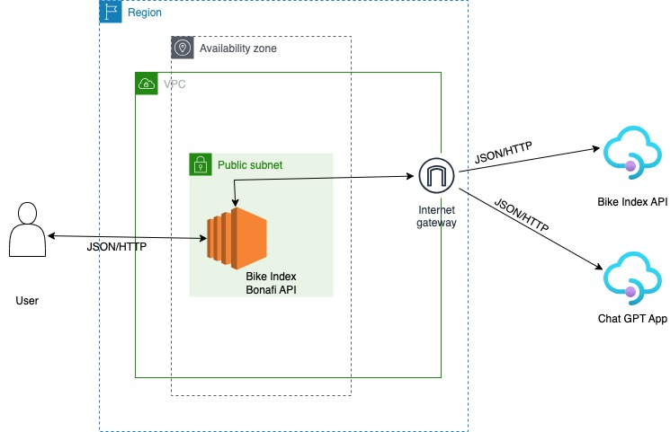

# Deployment Guide: Deploying Python App on AWS EC2

Guide to deploy the app on AWS EC2.

1. Create a VPC in AWS with below configurations.

        Select VPC and more.
        VPC Name : bikeIndexVPC
        IPv4 CIDR block : 10.0.0.0/26
        No. of availability zone : 1
        No. of public subnet : 1
        public subnet name : bikeIndexSubnet
        No. of private subnet : 0
        NAT Gateways : None

2. Create an EC2 instance called bikeIndexInstance with below configurations and launch it. 

        No. of instances : 1
        Software image : Amazon Linux
        Instance type : t2.micro
        Create and save key pair(login) in your local device
        Create Security group and allow HTTP and HTTPS traffic

3. Go to security groups and add a new inbound rule.

        Type : Custom TCP
        Port range : 5000

4. Connect to the ec2 instance using Putty from your local system using the key pair from step 2.

5. Execute the below commands in ec2 instance to run the application.

        sudo yum update -y
        sudo yum install python3 -y
        sudo yum install python3-pip -y
        sudo yum install git -y
        git clone https://github.com/vikaspattathe/bikeIndexApi.git
        cd bikeIndexApi
        pip install -r requirements.txt
        python3 main.py

The deployed application will be accessible at "\<Public IP of EC2\>:5000". Users can interact with the application through this address.

